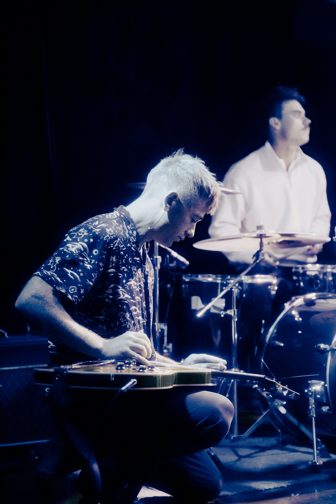
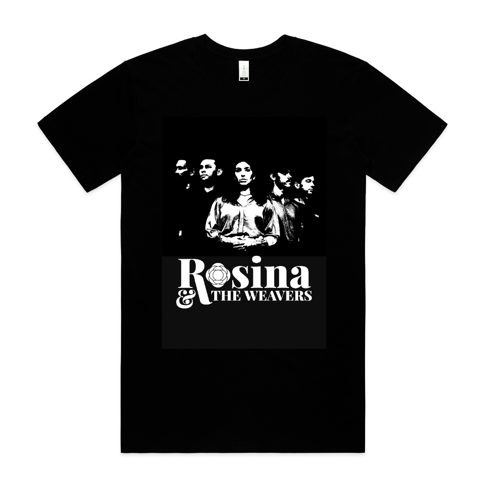

# .gitignore

```
# OS files
.DS_Store
Thumbs.db
desktop.ini

# Editor files
.vscode/
.idea/
*.swp
*.swo
*~

# Temporary files
*.tmp
*.log

# Node modules (if needed later)
node_modules/

# Build artifacts
dist/
build/

```

# css\style.css

```css
/* Rosina & The Weavers - Main Stylesheet */

/* Reset and Base Styles */
* {
    margin: 0;
    padding: 0;
    box-sizing: border-box;
}

body {
    background-color: #000000;
    font-family: -apple-system, BlinkMacSystemFont, 'Segoe UI', Roboto, Oxygen, Ubuntu, Cantarell, sans-serif;
    color: #ffffff;
    overflow-x: hidden;
}

/* ===================================
   Z-INDEX SCALE
   1-10: Content layers
   100-200: UI elements
   1000+: Critical overlays
   =================================== */

/* Hero Section */
.hero-section {
    min-height: 100vh;
    display: flex;
    flex-direction: column;
    justify-content: center;
    align-items: center;
    padding: 40px 20px 0 20px;
    position: relative;
    max-width: 2000px; /* Prevent massive scaling on ultra-wide screens */
    margin: 0 auto;
}

/* Logo Styles */
.logo-container {
    width: 100%;
    max-width: 600px;
    text-align: center;
    position: relative;
    z-index: 10;
    margin-bottom: -75px;
}

.logo-image {
    width: 100%;
    height: auto;
    max-width: 500px;
    display: block;
    margin: 0 auto;
}

/* Hero Image Styles */
.hero-image-container {
    width: 100%;
    max-width: none;
    position: relative;
    overflow: hidden;
    border-radius: 4px;
    height: 800px;
}

.hero-image {
    width: 110%;
    height: 100%;
    display: block;
    border-radius: 4px;
    object-fit: cover;
    object-position: 50% 65%;
    transform: translateX(-10%);
    loading: lazy; /* Performance: lazy load images */
}

/* Responsive Design - Tablet */
@media (max-width: 768px) {
    .logo-container {
        max-width: 400px;
        margin-bottom: -30px;
    }

    .logo-image {
        max-width: 350px;
    }

    .hero-image-container {
        max-width: 900px;
        height: 450px;
    }

    .hero-image {
        width: 120%;
        transform: translateX(-10%);
    }
}

/* Responsive Design - Mobile */
@media (max-width: 480px) {
    .hero-section {
        padding: 20px 15px 0 15px;
    }

    .logo-container {
        max-width: 300px;
        margin-bottom: -20px;
    }

    .logo-image {
        max-width: 250px;
    }

    .hero-image-container {
        max-width: 100%;
        height: 300px;
    }

    .hero-image {
        width: 120%;
        transform: translateX(-10%);
    }
}

/* ============================================ */
/* ABOUT SECTION */
/* ============================================ */

/* Development Separator - Remove when spacing is perfect */
.dev-separator {
    border-top: 2px solid #E91E8C;
}

.about-section {
    min-height: 100vh;
    display: flex;
    align-items: center;
    justify-content: center;
    padding: 80px 20px; /* ADJUST THIS: Controls vertical spacing around section */
    position: relative;
}

.about-container {
    width: 100%;
    /* CONTAINER WIDTH CONTROL:
       - max-width: none;     = Full screen width (image flush left, extends across screen)
       - max-width: 1200px;   = Centered container with margins on both sides
       - max-width: 90%;      = Centered container at 90% of screen width
    */
    max-width: none; /* ADJUST THIS: Set to 1200px to contain width, or none for full-width */
    position: relative;
    display: flex;
    align-items: center;
}

/* About Image - Takes up ~2/3 width on left side */
.about-image-wrapper {
    width: 66.666%; /* ADJUST THIS: Controls image width (2/3 = 66.666%) */
    position: relative;
    z-index: 1;
}

.about-image {
    width: 100%;
    height: auto;
    display: block;
    object-fit: cover;
    max-height: 900px; /* ADJUST THIS: Controls maximum image height */
    loading: lazy;
}

/* About Text Overlay - Positioned from center, overlaps image and black space */
.about-text-overlay {
    position: absolute;
    left: 50%; /* Start from center of container */
    top: 50%;
    transform: translateY(-50%); /* Center vertically */
    width: 50%; /* ADJUST THIS: Controls text container width */
    z-index: 10;
    padding: 40px; /* ADJUST THIS: Controls padding around text */
}

.about-text {
    color: #ffffff;
    font-size: 2rem; /* ADJUST THIS: Controls text size */
    line-height: 1.3; /* ADJUST THIS: Controls line spacing */
    text-align: left;
    font-weight: 400;
    letter-spacing: 0.01em;
}

/* Responsive Design - Tablet */
@media (max-width: 768px) {
    .about-section {
        padding: 60px 20px;
    }

    .about-text-overlay {
        width: 60%;
        padding: 30px;
    }

    .about-text {
        font-size: 1.2rem;
        line-height: 1.7;
    }
}

/* Responsive Design - Mobile */
@media (max-width: 480px) {
    .about-section {
        min-height: auto; /* FIX: Remove forced full-screen height causing black gaps */
        padding: 30px 15px; /* FIX: Was 0px - added breathing room */
    }

    .about-container {
        flex-direction: column;
    }

    .about-image-wrapper {
        width: 100%;
    }

    .about-image {
        max-height: 400px;
    }

    .about-text-overlay {
        position: relative;
        left: 0;
        top: 0;
        transform: none;
        width: 100%;
        padding: 20px; /* FIX: Was 0px 20px */
        margin-top: 20px;
    }

    .about-text {
        font-size: 1.1rem;
        line-height: 1.6;
    }
}

/* ===================================
   VIDEOS SECTION (Page 3)
   =================================== */

.videos-section {
    padding: 80px 20px;
    background-color: #000000;
}

.videos-container {
    max-width: 1400px;
    margin: 0 auto;
}

.section-title {
    color: #ffffff;
    font-size: 2.5rem;
    font-weight: 300;
    text-align: center;
    margin-bottom: 60px;
    letter-spacing: 2px;
}

/* Loading spinner for YouTube API */
.video-loading {
    position: absolute;
    top: 50%;
    left: 50%;
    transform: translate(-50%, -50%);
    color: #E91E8C;
    font-size: 2rem;
    z-index: 5;
}

.carousel-wrapper {
    display: flex;
    align-items: center;
    justify-content: center;
    gap: 40px;
    position: relative;
    z-index: 1;
}

.carousel-container {
    width: 100%;
    max-width: 1200px; /* ADJUST THIS: Controls video player size (was 900px) */
    /* OPTIONS:
       - 900px  = Original size (smaller)
       - 1200px = Medium-large (recommended)
       - 1400px = Very large
       - none   = Full screen width
    */
    overflow: hidden;
    position: relative;
    z-index: 1;
}

.carousel-track {
    display: flex;
    transition: transform 0.5s ease-in-out;
    position: relative;
    z-index: 1;
}

.carousel-slide {
    min-width: 100%;
    flex-shrink: 0;
    position: relative;
    z-index: 1;
}

.video-wrapper {
    position: relative;
    width: 100%;
    padding-bottom: 56.25%;
    height: 0;
    overflow: hidden;
    background-color: #000000;
    z-index: 1;
}

.video-wrapper iframe,
.video-wrapper > div {
    position: absolute;
    top: 0;
    left: 0;
    width: 100%;
    height: 100%;
    border: none;
}

.carousel-arrow {
    background-color: rgba(255, 255, 255, 0.1);
    border: 2px solid rgba(255, 255, 255, 0.3);
    color: #ffffff;
    width: 60px;
    height: 60px;
    border-radius: 50%;
    cursor: pointer;
    display: flex;
    align-items: center;
    justify-content: center;
    transition: all 0.3s ease;
    flex-shrink: 0;
    user-select: none;
    outline: none;
    position: relative;
    z-index: 1000;
}

.carousel-arrow:disabled {
    opacity: 0.3;
    cursor: not-allowed;
}

.carousel-arrow:hover:not(:disabled) {
    background-color: rgba(233, 30, 140, 0.3);
    border-color: #E91E8C;
    transform: scale(1.1);
}

.carousel-arrow:active:not(:disabled) {
    transform: scale(0.95);
}

.carousel-arrow svg,
.carousel-arrow i {
    pointer-events: none;
}

.carousel-indicators {
    display: flex;
    justify-content: center;
    gap: 12px;
    margin-top: 40px;
}

.indicator {
    width: 12px;
    height: 12px;
    border-radius: 50%;
    background-color: rgba(255, 255, 255, 0.3);
    border: none;
    cursor: pointer;
    transition: all 0.3s ease;
}

.indicator:hover {
    background-color: rgba(255, 255, 255, 0.5);
    transform: scale(1.2);
}

.indicator.active {
    background-color: #E91E8C;
    transform: scale(1.3);
}

@media (max-width: 768px) {
    .section-title {
        font-size: 2rem;
        margin-bottom: 40px;
    }

    .carousel-wrapper {
        gap: 20px;
    }

    .carousel-arrow {
        width: 50px;
        height: 50px;
    }

    .carousel-arrow svg,
    .carousel-arrow i {
        font-size: 24px;
    }
}

@media (max-width: 480px) {
    .videos-section {
        padding: 30px 15px; /* FIX: Was 60px - too much vertical space */
    }

    .section-title {
        font-size: 1.8rem;
        margin-bottom: 20px; /* FIX: Was 30px - tighter spacing */
    }

    .carousel-wrapper {
        gap: 15px;
    }

    .carousel-arrow {
        width: 45px;
        height: 45px;
    }

    .carousel-arrow svg,
    .carousel-arrow i {
        font-size: 20px;
    }

    .carousel-indicators {
        margin-top: 20px; /* FIX: Was 30px - tighter spacing */
        gap: 10px;
    }

    .indicator {
        width: 10px;
        height: 10px;
    }
}

/* ============================================ */
/* SHARED ICON STYLES (Base Class)
   Used by: Follow, BTS, Merch, Contact sections
   ============================================ */

.icon-base {
    width: 50px; /* ADJUST THIS: Icon container size (width) */
    height: 50px; /* ADJUST THIS: Icon container size (height) */
    display: flex;
    align-items: center;
    justify-content: center;
    color: #ffffff; /* ADJUST THIS: Icon color (default white) */
    background-color: transparent; /* ADJUST THIS: Background color behind icon */
    border-radius: 8px; /* ADJUST THIS: Rounded corners (0 = square, 50% = circle) */
    transition: all 0.3s ease; /* ADJUST THIS: Animation speed for hover effects */
    text-decoration: none;
    padding: 8px; /* ADJUST THIS: Internal padding around icon */
    font-size: 42px; /* ADJUST THIS: Font Awesome icon size (bigger number = bigger icon) */
}

/* Icon hover effect - pink/mauve accent */
.icon-base:hover {
    color: #E91E8C; /* ADJUST THIS: Icon color on hover (default pink/mauve) */
    background-color: rgba(233, 30, 140, 0.1); /* ADJUST THIS: Background opacity on hover */
    transform: translateY(-3px) scale(1.1); /* ADJUST THIS: Hover lift + scale effect */
}

/* ============================================ */
/* FOLLOW US SECTION (Page 4) */
/* ============================================ */

.follow-section {
    min-height: 100vh;
    display: flex;
    align-items: center;
    justify-content: center;
    padding: 80px 20px; /* FIXED: Standardized padding */
    position: relative;
    background-color: #000000;
}

.follow-container {
    width: 100%;
    max-width: none;
    position: relative;
    display: flex;
    align-items: center;
}

/* ===================================
   TEXT CONTENT (Left Side - 1/3 width)
   =================================== */

.follow-text-content {
    width: 60%; /* ADJUST THIS: Controls text section width (default 1/3 = 33.333%) */
    padding: 30px 120px; /* ADJUST THIS: 
                           - First value: top/bottom padding
                           - Second value: left/right padding (creates inset from edge) */
    z-index: 10;
    position: relative;
}

.follow-heading {
    color: #ffffff;
    font-size: 2rem; /* ADJUST THIS: Heading text size */
    font-weight: 400; /* ADJUST THIS: Font weight (300=light, 400=normal, 700=bold) */
    line-height: 1.3; /* ADJUST THIS: Line spacing */
    margin: 0 0 40px 0; /* ADJUST THIS: Space below heading before icons */
    text-align: left;
    letter-spacing: 0.01em;
}

/* ===================================
   SOCIAL MEDIA ICONS
   =================================== */

.social-icons {
    display: flex;
    flex-wrap: wrap;
    gap: 49px; /* ADJUST THIS: Space between icons */
    align-items: center;
}

.social-icon {
    /* Extends .icon-base - see shared styles above */
}

/* ===================================
   IMAGE (Right Side - 2/3 width)
   =================================== */

.follow-image-wrapper {
    width: 100%; /* ADJUST THIS: Controls image section width (default 2/3 = 66.666%) */
    margin-left: -200px;
    position: relative;
    z-index: 1;
    display: flex;
    justify-content: flex-end; /* Aligns image to right edge */
}

.follow-image {
    width: 100%;
    height: auto;
    display: block;
    object-fit: cover;
    max-height: 1200px; /* ADJUST THIS: Controls maximum image height */
    loading: lazy;
    
    object-position: center 55%; /* ADJUST THIS: 
                                       - First value: horizontal position (left/center/right or 0-100%)
                                       - Second value: vertical position (top/center/bottom or 0-100%)
                                       Examples:
                                       - center top = horizontally centered, top of image visible
                                       - right center = right side of image, vertically centered
                                       - 30% 70% = 30% from left, 70% from top */
    
    /* BLACK AND WHITE FILTER */
    filter: grayscale(100%); /* ADJUST THIS: 
                                - 100% = full black & white
                                - 50% = half color, half B&W
                                - 0% = full color
                                
                                OPTIONAL ADJUSTMENTS (add to filter):
                                - contrast(110%) = Increase contrast by 10%
                                - brightness(90%) = Darken by 10%
                                - Example: filter: grayscale(100%) contrast(110%) brightness(95%); */
}

/* Responsive Design - Tablet */
@media (max-width: 768px) {
    .follow-section {
        padding: 60px 20px;
    }

    .follow-container {
        flex-direction: column; /* Stack vertically on tablet */
    }

    .follow-text-content {
        width: 100%; /* Full width on tablet */
        padding: 40px 60px;
        text-align: center; /* Center text on tablet */
    }

    .follow-heading {
        font-size: 1.8rem;
        margin-bottom: 30px;
    }

    .social-icons {
        justify-content: center; /* Center icons on tablet */
        gap: 18px;
    }

    .social-icon {
        width: 45px;
        height: 45px;
        font-size: 24px; /* Slightly smaller on tablet */
    }

    .follow-image-wrapper {
        width: 100%; /* Full width on tablet */
        justify-content: center;
        margin-top: 40px; /* Space above image when stacked */
        margin-left: 0; /* FIXED: Reset negative margin on tablet */
    }

    .follow-image {
        max-height: 500px;
        width: 100%;
    }
}

/* Responsive Design - Mobile */
@media (max-width: 480px) {
    .follow-section {
        min-height: auto; /* FIX: Remove forced full-screen height causing black gaps */
        padding: 30px 15px; /* FIX: Was 0px - added breathing room */
    }

    .follow-text-content {
        padding: 20px; /* FIX: Was 0px 20px */
    }

    .follow-heading {
        font-size: 1.5rem;
        margin-bottom: 25px;
    }

    .social-icons {
        gap: 15px;
    }

    .social-icon {
        width: 40px;
        height: 40px;
        font-size: 20px; /* Smaller on mobile */
    }

    .follow-image-wrapper {
        margin-top: 20px; /* FIX: More space above image */
        margin-left: 0; /* FIX: Remove negative margin on mobile */
    }

    .follow-image {
        max-height: 400px;
    }
}

/* ============================================ */
/* BEHIND THE SCENES SECTION */
/* ============================================ */

.bts-section {
    min-height: 100vh;
    display: flex;
    align-items: center;
    justify-content: center;
    padding: 80px 20px; /* ADJUST THIS: Controls vertical spacing around section */
    position: relative;
}

.bts-container {
    width: 100%;
    max-width: none;
    position: relative;
    display: flex;
    align-items: center;
}

/* Behind the Scenes Image - Takes up ~2/3 width on left side */
.bts-image-wrapper {
    width: 66.666%; /* ADJUST THIS: Controls image width (2/3 = 66.666%) */
    position: relative;
    z-index: 1;
}

.bts-image {
    width: 100%;
    height: auto;
    display: block;
    object-fit: cover;
    max-height: 900px; /* ADJUST THIS: Controls maximum image height */
    loading: lazy;
}

/* Behind the Scenes Text Overlay - Positioned from center, overlaps image and black space */
.bts-text-overlay {
    position: absolute;
    left: 50%; /* Start from center of container */
    top: 50%;
    transform: translateY(-50%); /* Center vertically */
    width: 50%; /* ADJUST THIS: Controls text container width */
    z-index: 10;
    padding: 40px; /* ADJUST THIS: Controls padding around text */
}

.bts-heading {
    color: #ffffff;
    font-size: 2.5rem; /* ADJUST THIS: Heading text size */
    font-weight: 500; /* ADJUST THIS: Font weight (300=light, 400=normal, 700=bold) */
    line-height: 1.3; /* ADJUST THIS: Line spacing */
    margin: 0 0 20px 0; /* ADJUST THIS: Space below heading before body text */
    text-align: left;
    letter-spacing: 0.01em;
}

.bts-text {
    color: #ffffff;
    font-size: 2rem; /* ADJUST THIS: Heading text size */
    font-weight: 400; /* ADJUST THIS: Font weight (300=light, 400=normal, 700=bold) */
    line-height: 1.3; /* ADJUST THIS: Line spacing */
    margin: 0 0 40px 0; /* ADJUST THIS: Space below heading before icons */
    text-align: left;
    letter-spacing: 0.01em;
}

/* ===================================
   BEHIND THE SCENES ICONS
   =================================== */

.bts-icons {
    display: flex;
    flex-wrap: wrap;
    gap: 49px; /* ADJUST THIS: Space between icons */
    align-items: center;
}

.bts-icon {
    /* Extends .icon-base - see shared styles above */
}

/* Responsive Design - Tablet */
@media (max-width: 768px) {
    .bts-section {
        padding: 60px 20px;
    }

    .bts-text-overlay {
        width: 60%;
        padding: 30px;
    }

    .bts-text {
        font-size: 1.2rem;
        line-height: 1.7;
    }
}

/* Responsive Design - Mobile */
@media (max-width: 480px) {
    .bts-section {
        min-height: auto; /* FIX: Remove forced full-screen height causing black gaps */
        padding: 30px 15px; /* FIX: Reduced from 40px for tighter mobile spacing */
    }

    .bts-container {
        flex-direction: column;
    }

    .bts-image-wrapper {
        width: 100%;
    }

    .bts-image {
        max-height: 400px;
    }

    .bts-text-overlay {
        position: relative;
        left: 0;
        top: 0;
        transform: none;
        width: 100%;
        padding: 30px 20px;
        margin-top: 20px;
    }

    .bts-text {
        font-size: 1.1rem;
        line-height: 1.6;
    }
}

/* ============================================ */
/* MERCH SECTION */
/* ============================================ */

.merch-section {
    min-height: 100vh;
    display: flex;
    align-items: center;
    justify-content: center;
    padding: 80px 20px; /* FIXED: Standardized padding */
    position: relative;
    background-color: #000000;
}

.merch-container {
    width: 100%;
    max-width: none;
    position: relative;
    display: flex;
    align-items: center;
}

/* ===================================
   TEXT CONTENT (Left Side - 40% width)
   =================================== */

.merch-text-content {
    width: 40%; /* ADJUST THIS: Controls text section width */
    padding: 0px 80px; /* ADJUST THIS: 
                           - First value: top/bottom padding
                           - Second value: left/right padding (creates inset from edge) */
    z-index: 10;
    position: relative;
}

.merch-heading {
    color: #ffffff;
    font-size: 2rem; /* ADJUST THIS: Heading text size */
    font-weight: 400; /* ADJUST THIS: Font weight (300=light, 400=normal, 700=bold) */
    line-height: 1.3; /* ADJUST THIS: Line spacing */
    margin: 0 0 20px 0; /* ADJUST THIS: Space below heading before subtext */
    text-align: left;
    letter-spacing: 0.01em;
}

.merch-subtext {
    color: #ffffff;
    font-size: 1.2rem; /* ADJUST THIS: Subtext size */
    font-weight: 300; /* ADJUST THIS: Lighter weight for subtext */
    line-height: 1.5;
    margin: 0; /* Removed margin - now controlled by wrapper */
    text-align: left;
}

/* ===================================
   BANDCAMP TEXT + ICON (Inline)
   =================================== */

.merch-bandcamp-wrapper {
    display: flex;
    align-items: center; /* Vertically align text and icon */
    gap: 15px; /* ADJUST THIS: Space between text and icon */
    margin-bottom: 0; /* ADJUST THIS: Space below the text+icon row */
}

.merch-icon {
    /* Extends .icon-base - see shared styles above */
}

/* ===================================
   PRODUCT IMAGES (Right Side - 60% width)
   =================================== */

.merch-images-wrapper {
    width: 60%; /* ADJUST THIS: Controls images section width */
    display: flex;
    justify-content: flex-end; /* Align images to the right */
    align-items: center;
    gap: 30px; /* ADJUST THIS: Space between product images */
    padding: 0px 200px 0px 0px; /* ADJUST THIS: Padding around image group */
    position: relative;
    z-index: 1;
}

.merch-product-link {
    display: block;
    transition: all 0.3s ease;
    max-width: 250px; /* ADJUST THIS: Maximum width of each product image */
}

/* Product image hover effect */
.merch-product-link:hover {
    transform: translateY(-8px) scale(1.05); /* ADJUST THIS: Lift and scale on hover */
}

.merch-product-image {
    width: 100%;
    height: auto;
    display: block;
    object-fit: contain; /* Maintains aspect ratio without cropping */
    border-radius: 8px; /* ADJUST THIS: Rounded corners on images */
    loading: lazy;
    
    /* Optional: Add subtle shadow for depth */
    box-shadow: 0 4px 20px rgba(233, 30, 140, 0.1); /* ADJUST THIS: Pink glow effect */
    transition: box-shadow 0.3s ease;
}

/* Enhance shadow on hover */
.merch-product-link:hover .merch-product-image {
    box-shadow: 0 8px 30px rgba(233, 30, 140, 0.3); /* ADJUST THIS: Stronger pink glow on hover */
}

/* Responsive Design - Tablet */
@media (max-width: 768px) {
    .merch-section {
        padding: 60px 20px;
    }

    .merch-container {
        flex-direction: column; /* Stack vertically on tablet */
    }

    .merch-text-content {
        width: 100%; /* Full width on tablet */
        padding: 40px 60px;
        text-align: center; /* Center text on tablet */
    }

    .merch-heading {
        font-size: 1.8rem;
    }

    .merch-subtext {
        font-size: 1.1rem;
    }

    .merch-bandcamp-wrapper {
        justify-content: center; /* Center text+icon on tablet */
    }

    .merch-images-wrapper {
        width: 100%; /* Full width on tablet */
        justify-content: center; /* Center images on tablet */
        gap: 20px;
        padding: 40px 20px;
    }

    .merch-product-link {
        max-width: 200px; /* Smaller images on tablet */
    }
}

/* Responsive Design - Mobile */
@media (max-width: 480px) {
    .merch-section {
        min-height: auto; /* FIX: Remove forced full-screen height causing black gaps */
        padding: 30px 15px; /* FIX: Tighter mobile spacing */
    }

    .merch-text-content {
        padding: 20px;
    }

    .merch-heading {
        font-size: 1.5rem;
        margin-bottom: 15px;
    }

    .merch-subtext {
        font-size: 1rem;
    }

    .merch-bandcamp-wrapper {
        gap: 10px; /* Tighter spacing on mobile */
    }

    .merch-icon {
        width: 40px;
        height: 40px;
        font-size: 32px;
    }

    .merch-images-wrapper {
        flex-direction: column; /* Stack images vertically on mobile */
        gap: 20px;
        padding: 30px 20px;
    }

    .merch-product-link {
        max-width: 180px; /* Smaller images on mobile */
    }
}

/* ============================================ */
/* CONTACT US SECTION */
/* ============================================ */

.contact-us-section {
    min-height: 100vh;
    display: flex;
    align-items: center;
    justify-content: center;
    padding: 80px 20px; /* FIXED: Standardized padding */
    position: relative;
}

.contact-us-container {
    width: 100%;
    max-width: none;
    position: relative;
    display: flex;
    align-items: center;
}

/* Contact Us Image - Takes up ~2/3 width on left side */
.contact-us-image-wrapper {
    width: 66.666%; /* ADJUST THIS: Controls image width (2/3 = 66.666%) */
    position: relative;
    z-index: 1;
}

.contact-us-image {
    width: 100%;
    height: auto;
    display: block;
    object-fit: cover;
    max-height: 900px; /* ADJUST THIS: Controls maximum image height */
    loading: lazy;
}

/* Contact Us Text Overlay - Positioned from center, overlaps image and black space */
.contact-us-text-overlay {
    position: absolute;
    left: 50%; /* Start from center of container */
    top: 50%;
    transform: translateY(-50%); /* Center vertically */
    width: 50%; /* ADJUST THIS: Controls text container width */
    z-index: 10;
    padding: 40px; /* ADJUST THIS: Controls padding around text */
}

/* Entire heading + icon as a clickable link */
.contact-us-heading-link {
    display: flex;
    align-items: center; /* Vertically center heading and icon */
    gap: 20px; /* ADJUST THIS: Space between heading and icon */
    margin-bottom: 20px; /* ADJUST THIS: Space below heading/icon row */
    text-decoration: none; /* Remove underline */
    color: #ffffff; /* Default white */
    transition: color 0.3s ease; /* Smooth color transition */
    cursor: pointer;
}

/* Hover effect - both text and icon turn magenta together */
.contact-us-heading-link:hover {
    color: #E91E8C; /* Magenta/pink on hover */
}

.contact-us-heading-link:hover .contact-us-heading {
    color: #E91E8C; /* Magenta/pink on hover */
}

.contact-us-heading-link:hover .contact-us-icon-inline {
    color: #E91E8C; /* Magenta/pink on hover */
    transform: translateY(-3px) scale(1.1); /* Slight lift effect */
}

.contact-us-heading {
    color: inherit; /* Inherit from parent link */
    font-size: 2.5rem; /* ADJUST THIS: Heading text size */
    font-weight: 500; /* ADJUST THIS: Font weight (300=light, 400=normal, 700=bold) */
    line-height: 1.3; /* ADJUST THIS: Line spacing */
    margin: 0; /* Remove margin - controlled by wrapper */
    text-align: left;
    letter-spacing: 0.01em;
    transition: color 0.3s ease; /* Smooth color transition */
}

.contact-us-text {
    color: #ffffff;
    font-size: 2rem; /* ADJUST THIS: Heading text size */
    font-weight: 400; /* ADJUST THIS: Font weight (300=light, 400=normal, 700=bold) */
    line-height: 1.3; /* ADJUST THIS: Line spacing */
    margin: 0 0 40px 0; /* ADJUST THIS: Space below heading before icons */
    text-align: left;
    letter-spacing: 0.01em;
}

/* ===================================
   CONTACT US ICONS
   =================================== */

/* Inline icon (next to heading) - now inside the link */
.contact-us-icon-inline {
    font-size: 50px; /* ADJUST THIS: Icon size - matches heading scale */
    color: inherit; /* Inherit color from parent link */
    transition: all 0.3s ease; /* Smooth transitions */
}

/* Standard icon container (if you add more icons later) */
.contact-us-icons {
    display: flex;
    flex-wrap: wrap;
    gap: 49px; /* ADJUST THIS: Space between icons */
    align-items: center;
}

.contact-us-icon {
    /* Extends .icon-base - see shared styles above */
}

/* Responsive Design - Tablet */
@media (max-width: 768px) {
    .contact-us-section {
        padding: 60px 20px;
    }

    .contact-us-text-overlay {
        width: 60%;
        padding: 30px;
    }

    .contact-us-text {
        font-size: 1.2rem;
        line-height: 1.7;
    }
}

/* Responsive Design - Mobile */
@media (max-width: 480px) {
    .contact-us-section {
        min-height: auto; /* FIX: Remove forced full-screen height causing black gaps */
        padding: 30px 15px; /* FIX: Reduced from 40px for tighter mobile spacing */
    }

    .contact-us-container {
        flex-direction: column;
    }

    .contact-us-image-wrapper {
        width: 100%;
    }

    .contact-us-image {
        max-height: 400px;
    }

    .contact-us-text-overlay {
        position: relative;
        left: 0;
        top: 0;
        transform: none;
        width: 100%;
        padding: 30px 20px;
        margin-top: 20px;
    }

    .contact-us-heading-link {
        gap: 15px; /* Tighter spacing on mobile */
    }

    .contact-us-heading {
        font-size: 1.8rem; /* Smaller heading on mobile */
    }

    .contact-us-icon-inline {
        font-size: 40px; /* Smaller icon on mobile */
    }

    .contact-us-text {
        font-size: 1.1rem;
        line-height: 1.6;
    }
}

/* ============================================ */
/* APPLY ICON-BASE TO ALL ICON CLASSES */
/* ============================================ */

.social-icon,
.bts-icon,
.merch-icon,
.contact-us-icon {
    /* All inherit from .icon-base */
    width: 50px;
    height: 50px;
    display: flex;
    align-items: center;
    justify-content: center;
    color: #ffffff;
    background-color: transparent;
    border-radius: 8px;
    transition: all 0.3s ease;
    text-decoration: none;
    padding: 8px;
    font-size: 42px;
}

.social-icon:hover,
.bts-icon:hover,
.merch-icon:hover,
.contact-us-icon:hover {
    color: #E91E8C;
    background-color: rgba(233, 30, 140, 0.1);
    transform: translateY(-3px) scale(1.1);
}

```

# images\band-photos\Dressing Room.jpg

This is a binary file of the type: Image

# images\band-photos\Harrington Hall - Hallway.jpg

This is a binary file of the type: Image

# images\band-photos\Hawea.JPG

This is a binary file of the type: Image

# images\band-photos\Last Wednesdays.jpg

This is a binary file of the type: Image

# images\band-photos\Live 1.jpg

This is a binary file of the type: Image

# images\band-photos\Live 2.jpg

This is a binary file of the type: Image

# images\band-photos\Live 3.jpg

This is a binary file of the type: Image

# images\band-photos\Matt.jpg

This is a binary file of the type: Image

# images\band-photos\Okarito Hall.JPG

This is a binary file of the type: Image

# images\band-photos\Okarito Outside.JPG

This is a binary file of the type: Image

# images\band-photos\Rosina Bathroom 1.jpg

This is a binary file of the type: Image

# images\band-photos\Rosina Bed 1.jpg

This is a binary file of the type: Image

# images\band-photos\Rosina Bed 2.jpg

This is a binary file of the type: Image

# images\band-photos\Rosina Live.jpg

This is a binary file of the type: Image

# images\band-photos\Rosina Street Closeup.jpg

This is a binary file of the type: Image

# images\band-photos\Rosina Street.jpg

This is a binary file of the type: Image

# images\band-photos\Rosina_hokitika_bw.jpg

This is a binary file of the type: Image

# images\band-photos\Rosina_hokitika.jpeg

This is a binary file of the type: Image

# images\logos\black rose png.png

This is a binary file of the type: Image

# images\logos\circle-pink-redmono.png

This is a binary file of the type: Image

# images\logos\circle-red-pinkmono.png

This is a binary file of the type: Image

# images\logos\circle-red-whitemono.png

This is a binary file of the type: Image

# images\logos\ros-white png.png

This is a binary file of the type: Image

# images\logos\ros-whiteontransparent.png

This is a binary file of the type: Image

# images\logos\rosina-fulllogo-black.png

This is a binary file of the type: Image

# images\logos\rosina-fulllogo-white.png

This is a binary file of the type: Image

# images\logos\rosina-fulllogo-whiteontransparent.png

This is a binary file of the type: Image

# images\logos\rosina-monogram-black.png

This is a binary file of the type: Image

# images\logos\rosina-monogram-white.png

This is a binary file of the type: Image

# images\merch\black-t.png

This is a binary file of the type: Image

# images\merch\vinyl-1.png

This is a binary file of the type: Image

# images\merch\vinyl-2.jpg

This is a binary file of the type: Image

# images\merch\vinyl-3.jpg

This is a binary file of the type: Image

# images\merch\white-t.png

This is a binary file of the type: Image

# index.html

```html
<!DOCTYPE html>
<html lang="en">
<head>
    <meta charset="UTF-8">
    <meta name="viewport" content="width=device-width, initial-scale=1.0">
    
    <!-- Security Headers - Uncomment when deploying to production -->
    <!--
    <meta http-equiv="X-Content-Type-Options" content="nosniff">
    <meta http-equiv="X-Frame-Options" content="SAMEORIGIN">
    <meta http-equiv="X-XSS-Protection" content="1; mode=block">
    -->
    
    <title>Rosina & The Weavers</title>
    
    <!-- External Stylesheets with Subresource Integrity (SRI) -->
    <link rel="stylesheet" 
          href="https://cdnjs.cloudflare.com/ajax/libs/font-awesome/6.5.1/css/all.min.css"
          integrity="sha512-DTOQO9RWCH3ppGqcWaEA1BIZOC6xxalwEsw9c2QQeAIftl+Vegovlnee1c9QX4TctnWMn13TZye+giMm8e2LwA=="
          crossorigin="anonymous"
          referrerpolicy="no-referrer">
    
    <link rel="stylesheet" 
          href="https://cdn.jsdelivr.net/npm/bootstrap-icons@1.11.3/font/bootstrap-icons.min.css"
          integrity="sha512-dPXYcDub/aeb08c63jRq/k6GaKccl256JQy/AnOq7CAnEZ9FzSL9wSbcZkMp4R26vBsMLFYH4kQ67/bbV8XaCQ=="
          crossorigin="anonymous"
          referrerpolicy="no-referrer">
    
    <link rel="stylesheet" href="css/style.css">
</head>
<body>
    <section class="hero-section">
        <!-- Logo -->
        <div class="logo-container">
            
        </div>

        <!-- Hero Image -->
        <div class="hero-image-container">
            
        </div>
    </section>

    <!-- About Section -->
    <section class="about-section dev-separator">
        <div class="about-container">
            <div class="about-image-wrapper">
                
            </div>
            <div class="about-text-overlay">
                <p class="about-text">
                    We are an independent band from Aotearoa, NZ who blend elements of semi-psychedelic rock, folk, pop, idk whatever you want to call it. Genres are basically nonsense. Don't worry though - it's not jazz…
                </p>
            </div>
        </div>
    </section>

    <!-- Videos Section -->
    <section class="videos-section dev-separator">
        <div class="videos-container">
            
            <div class="carousel-wrapper">
                <!-- Left Arrow -->
                <button class="carousel-arrow carousel-arrow-left" aria-label="Previous video" disabled>
                    <i class="fas fa-chevron-left"></i>
                </button>

                <!-- Video Container -->
                <div class="carousel-container">
                    <div class="carousel-track">                        

                        <!-- Video 1 -->
                        <div class="carousel-slide">
                            <div class="video-wrapper">
                                <iframe width="1455" height="818" 
                                    src="https://www.youtube.com/embed/a_fgZUi_Xg0?list=RDa_fgZUi_Xg0" 
                                    title="Bowie in the Bathtub - Rosina &amp; The Weavers (Official Video)" 
                                    frameborder="0" 
                                    allow="accelerometer; autoplay; clipboard-write; encrypted-media; gyroscope; picture-in-picture; web-share" 
                                    referrerpolicy="strict-origin-when-cross-origin" 
                                    allowfullscreen
                                    loading="lazy">
                                </iframe>
                            </div>
                        </div>

                        <!-- Video 2 -->
                        <div class="carousel-slide active">
                            <div class="video-wrapper">
                                <iframe width="1455" height="818" 
                                src="https://www.youtube.com/embed/T2Oo0MAsP7E?list=RDT2Oo0MAsP7E" 
                                title="Friday Night At The Kentish (Official Music Video)" 
                                frameborder="0" 
                                allow="accelerometer; autoplay; clipboard-write; encrypted-media; gyroscope; picture-in-picture; web-share" 
                                referrerpolicy="strict-origin-when-cross-origin" 
                                allowfullscreen
                                loading="lazy">
                            </iframe>
                            </div>
                        </div>

                        <!-- Video 3 -->
                        <div class="carousel-slide">
                            <div class="video-wrapper">
                                <iframe width="1455" height="818"  
                                    src="https://www.youtube.com/embed/Jsvh3Yy6viM?list=RDJsvh3Yy6viM" 
                                    title="Rosina &amp; The Weavers - &quot;High Country High&quot; (Official Music Video)" 
                                    frameborder="0" 
                                    allow="accelerometer; autoplay; clipboard-write; encrypted-media; gyroscope; picture-in-picture; web-share" 
                                    referrerpolicy="strict-origin-when-cross-origin" 
                                    allowfullscreen
                                    loading="lazy">
                                </iframe>
                            </div>
                        </div>
                    </div>
                </div>

                <!-- Right Arrow -->
                <button class="carousel-arrow carousel-arrow-right" aria-label="Next video" disabled>
                    <i class="fas fa-chevron-right"></i>
                </button>
            </div>

            <!-- Carousel Indicators -->
            <div class="carousel-indicators">
                <button class="indicator active" data-slide="0" aria-label="Go to video 1"></button>
                <button class="indicator" data-slide="1" aria-label="Go to video 2"></button>
                <button class="indicator" data-slide="2" aria-label="Go to video 3"></button>
            </div>
        </div>
    </section>

    <!-- Follow Us Section (Page 4) -->
    <section class="follow-section dev-separator">
        <div class="follow-container">
            <!-- Text Content (Left Side) -->
            <div class="follow-text-content">
                <h2 class="follow-heading">Find and follow us wherever you listen:</h2>
                
                <!-- Social Media Icons -->
                <div class="social-icons">
                    <!-- Facebook -->
                    <a href="https://www.facebook.com/rosinaandtheweavers" 
                       class="social-icon" 
                       target="_blank" 
                       rel="noopener noreferrer"
                       aria-label="Follow us on Facebook">
                        <i class="fab fa-facebook"></i>
                    </a>

                    <!-- Instagram -->
                    <a href="https://www.instagram.com/rosinaandtheweavers" 
                       class="social-icon" 
                       target="_blank" 
                       rel="noopener noreferrer"
                       aria-label="Follow us on Instagram">
                        <i class="fab fa-instagram"></i>
                    </a>

                    <!-- Bandcamp -->
                    <a href="https://rosinaandtheweavers.bandcamp.com" 
                       class="social-icon" 
                       target="_blank" 
                       rel="noopener noreferrer"
                       aria-label="Follow us on Bandcamp">
                        <i class="fab fa-bandcamp"></i>
                    </a>

                    <!-- YouTube -->
                    <a href="https://www.youtube.com/@rosinaandtheweavers" 
                       class="social-icon" 
                       target="_blank" 
                       rel="noopener noreferrer"
                       aria-label="Follow us on YouTube">
                        <i class="fab fa-youtube"></i>
                    </a>

                    <!-- Apple Music -->
                    <a href="https://music.apple.com/nz/artist/rosina-the-weavers/1600581381" 
                       class="social-icon" 
                       target="_blank" 
                       rel="noopener noreferrer"
                       aria-label="Follow us on Apple Music">
                        <i class="fab fa-apple"></i>
                    </a>

                    <!-- Spotify -->
                    <a href="https://open.spotify.com/artist/25iMzaAjACIW7AEBnpRUiL" 
                       class="social-icon" 
                       target="_blank" 
                       rel="noopener noreferrer"
                       aria-label="Follow us on Spotify">
                        <i class="fab fa-spotify"></i>
                    </a>
                </div>
            </div>

            <!-- Image (Right Side) -->
            <div class="follow-image-wrapper">
                
            </div>
        </div>
    </section>

    <!-- Behind the Scenes Section -->
    <section class="bts-section dev-separator">
        <div class="bts-container">
            <div class="bts-image-wrapper">
                
            </div>
            <div class="bts-text-overlay">
                <h2 class="bts-heading">Get behind the scenes</h2>
                <p class="bts-text">
                    Subscribe for songs-in-progress, late night wonderings, and journalistic ramblings from Rosina
                </p>
                <!-- Behind the Scenes Icons -->
                <div class="bts-icons">
                    <!-- Substack -->
                    <a href="https://substack.com/@rosinarecords?utm_source=global-search" 
                       class="bts-icon" 
                       target="_blank" 
                       rel="noopener noreferrer"
                       aria-label="Behind the scenes - Substack">
                        <i class="bi bi-substack"></i>
                    </a>

                    <!-- Patreon -->
                    <a href="https://www.patreon.com/cw/u92877351" 
                       class="bts-icon" 
                       target="_blank" 
                       rel="noopener noreferrer"
                       aria-label="Behind the scenes - Patreon">
                        <i class="fab fa-patreon"></i>
                    </a>
                </div>
            </div>
        </div>
    </section>

    <!-- Merch Section -->
    <section class="merch-section dev-separator">
        <div class="merch-container">
            <!-- Text Content (Left Side) -->
            <div class="merch-text-content">
                <h2 class="merch-heading">Buy a vinyl or a t-shirt and help us stay alive long enough to record the next album.</h2>
                
                <!-- Bandcamp Text + Icon -->
                <div class="merch-bandcamp-wrapper">
                    <p class="merch-subtext">Head through to Bandcamp to purchase.</p>
                    <a href="https://rosinaandtheweavers.bandcamp.com/merch" 
                       class="merch-icon" 
                       target="_blank" 
                       rel="noopener noreferrer"
                       aria-label="Shop on Bandcamp">
                        <i class="fab fa-bandcamp"></i>
                    </a>
                </div>
            </div>

            <!-- Product Images (Right Side) -->
            <div class="merch-images-wrapper">
                <!-- Black T-Shirt -->
                <a href="https://rosinaandtheweavers.bandcamp.com/merch" 
                   class="merch-product-link" 
                   target="_blank" 
                   rel="noopener noreferrer"
                   aria-label="Buy Black T-Shirt">
                    
                </a>

                <!-- White T-Shirt -->
                <a href="https://rosinaandtheweavers.bandcamp.com/merch" 
                   class="merch-product-link" 
                   target="_blank" 
                   rel="noopener noreferrer"
                   aria-label="Buy White T-Shirt">
                    
                </a>

                <!-- Vinyl Record -->
                <a href="https://rosinaandtheweavers.bandcamp.com/merch" 
                   class="merch-product-link" 
                   target="_blank" 
                   rel="noopener noreferrer"
                   aria-label="Buy Vinyl Record">
                    
                </a>
            </div>
        </div>
    </section>

    <!-- Contact Us Section -->
    <section class="contact-us-section dev-separator">
        <div class="contact-us-container">
            <div class="contact-us-image-wrapper">
                
            </div>
            <div class="contact-us-text-overlay">
                <!-- Entire heading is now a link -->
                <a href="mailto:rosinaandtheweavers@gmail.com" 
                   class="contact-us-heading-link" 
                   aria-label="Email us">
                    <h2 class="contact-us-heading">Email us</h2>
                    <i class="fas fa-envelope contact-us-icon-inline"></i>
                </a>
                <p class="contact-us-text">
                    Yes, we'd like to play your venue, your festival, <br> and your private yacht.
                </p>
            </div>
        </div>
    </section>

    <!-- JavaScript - Load at end for better performance -->
    <script src="js/carousel.js"></script>
</body>
</html>

```

# js\carousel.js

```js
// YouTube Video Carousel with Loading States and Enhanced Error Handling
document.addEventListener('DOMContentLoaded', function() {
    const track = document.querySelector('.carousel-track');
    const slides = Array.from(document.querySelectorAll('.carousel-slide'));
    const indicators = Array.from(document.querySelectorAll('.indicator'));
    const prevButton = document.querySelector('.carousel-arrow-left');
    const nextButton = document.querySelector('.carousel-arrow-right');
    
    let currentSlide = 0;
    const totalSlides = slides.length;
    let players = [];
    let apiReady = false;
    let retryAttempts = 0;
    const maxRetries = 3;

    // Disable navigation until API is ready
    if (prevButton) prevButton.disabled = true;
    if (nextButton) nextButton.disabled = true;

    // Load YouTube IFrame API
    const tag = document.createElement('script');
    tag.src = "https://www.youtube.com/iframe_api";
    const firstScriptTag = document.getElementsByTagName('script')[0];
    firstScriptTag.parentNode.insertBefore(tag, firstScriptTag);

    // Initialize YouTube players when API is ready
    window.onYouTubeIframeAPIReady = function() {
        slides.forEach((slide, index) => {
            const iframe = slide.querySelector('iframe');
            if (iframe) {
                const videoId = iframe.src.match(/embed\/([^?]+)/)[1];
                const playerDiv = document.createElement('div');
                playerDiv.id = `player-${index}`;
                iframe.parentNode.replaceChild(playerDiv, iframe);
                
                try {
                    players[index] = new YT.Player(`player-${index}`, {
                        videoId: videoId,
                        width: '100%',
                        height: '100%',
                        playerVars: {
                            'modestbranding': 1,
                            'rel': 0
                        },
                        events: {
                            'onReady': onPlayerReady
                        }
                    });
                } catch (error) {
                    console.error('Error creating YouTube player:', error);
                }
            }
        });
        apiReady = true;
        
        // Enable navigation once API is ready
        if (prevButton) prevButton.disabled = false;
        if (nextButton) nextButton.disabled = false;
    };

    // Player ready callback
    function onPlayerReady(event) {
        // Optional: Auto-play first video or other setup
        // event.target.playVideo();
    }

    // Pause all videos with retry logic
    function pauseAllVideos() {
        if (!apiReady) {
            // If API not ready, retry after delay
            if (retryAttempts < maxRetries) {
                retryAttempts++;
                setTimeout(pauseAllVideos, 100);
            }
            return;
        }
        
        retryAttempts = 0; // Reset retry counter
        
        players.forEach((player, index) => {
            if (player && player.pauseVideo) {
                try {
                    player.pauseVideo();
                } catch (e) {
                    console.warn(`Could not pause player ${index}:`, e);
                }
            }
        });
    }

    // Update carousel to show specific slide
    function updateCarousel(index) {
        pauseAllVideos();
        
        slides.forEach(slide => slide.classList.remove('active'));
        indicators.forEach(indicator => indicator.classList.remove('active'));
        
        slides[index].classList.add('active');
        indicators[index].classList.add('active');
        
        track.style.transform = `translateX(-${index * 100}%)`;
    }

    // Next slide
    function nextSlide(event) {
        event.preventDefault();
        event.stopPropagation();
        
        currentSlide = (currentSlide + 1) % totalSlides;
        updateCarousel(currentSlide);
        
        return false;
    }

    // Previous slide
    function prevSlide(event) {
        event.preventDefault();
        event.stopPropagation();
        
        currentSlide = (currentSlide - 1 + totalSlides) % totalSlides;
        updateCarousel(currentSlide);
        
        return false;
    }

    // Event listeners for arrows
    if (nextButton) {
        nextButton.addEventListener('click', nextSlide, true);
        nextButton.addEventListener('dblclick', (e) => {
            e.preventDefault();
            e.stopPropagation();
            return false;
        }, true);
    }
    
    if (prevButton) {
        prevButton.addEventListener('click', prevSlide, true);
        prevButton.addEventListener('dblclick', (e) => {
            e.preventDefault();
            e.stopPropagation();
            return false;
        }, true);
    }

    // Event listeners for indicators
    indicators.forEach((indicator, index) => {
        indicator.addEventListener('click', (e) => {
            e.preventDefault();
            e.stopPropagation();
            currentSlide = index;
            updateCarousel(currentSlide);
        }, true);
    });

    // Keyboard navigation
    document.addEventListener('keydown', (e) => {
        if (e.key === 'ArrowLeft') {
            e.preventDefault();
            prevSlide(e);
        }
        if (e.key === 'ArrowRight') {
            e.preventDefault();
            nextSlide(e);
        }
    });

    // Set initial slide on page load
    updateCarousel(currentSlide);
});

```

# MOBILE-FIX-SUMMARY.md

```md
# Mobile Spacing Fix - February 7, 2026

## Problem Identified

Massive black spaces appearing between sections on mobile devices caused by:

1. **`min-height: 100vh`** forcing sections to be full viewport height
2. **`padding: 0px`** providing no breathing room between sections
3. **Negative margins** on images causing layout issues on small screens

## Solutions Applied

### 1. About Section (Mobile - ≤480px)
**BEFORE:**
\`\`\`css
.about-section {
    padding: 0px 15px; /* No vertical padding = content bunched at top */
}
.about-text-overlay {
    padding: 0px 20px; /* No top/bottom padding */
}
\`\`\`

**AFTER:**
\`\`\`css
.about-section {
    min-height: auto; /* Remove forced full-screen height */
    padding: 30px 15px; /* Added breathing room */
}
.about-text-overlay {
    padding: 20px; /* Added top/bottom padding */
}
\`\`\`

### 2. Videos Section (Mobile - ≤480px)
**BEFORE:**
\`\`\`css
.videos-section {
    padding: 60px 15px; /* Too much vertical space */
}
\`\`\`

**AFTER:**
\`\`\`css
.videos-section {
    padding: 30px 15px; /* Tighter, more mobile-friendly spacing */
}
\`\`\`

### 3. Follow Us Section (Mobile - ≤480px)
**BEFORE:**
\`\`\`css
.follow-section {
    padding: 0px 15px; /* No vertical padding */
}
.follow-text-content {
    padding: 0px 20px; /* No vertical padding */
}
.follow-image-wrapper {
    margin-top: 10px;
    margin-left: -200px; /* Negative margin breaks mobile layout */
}
\`\`\`

**AFTER:**
\`\`\`css
.follow-section {
    min-height: auto; /* Remove forced full-screen height */
    padding: 30px 15px; /* Added breathing room */
}
.follow-text-content {
    padding: 20px; /* Added vertical padding */
}
.follow-image-wrapper {
    margin-top: 20px; /* More space */
    margin-left: 0; /* Remove negative margin on mobile */
}
\`\`\`

### 4. Behind the Scenes Section (Mobile - ≤480px)
**BEFORE:**
\`\`\`css
.bts-section {
    padding: 40px 15px;
    /* min-height: 100vh still active from desktop */
}
\`\`\`

**AFTER:**
\`\`\`css
.bts-section {
    min-height: auto; /* Remove forced full-screen height */
    padding: 30px 15px; /* Slightly tighter spacing */
}
\`\`\`

### 5. Contact Us Section (Mobile - ≤480px)
**BEFORE:**
\`\`\`css
.contact-us-section {
    padding: 40px 15px;
    /* min-height: 100vh still active from desktop */
}
\`\`\`

**AFTER:**
\`\`\`css
.contact-us-section {
    min-height: auto; /* Remove forced full-screen height */
    padding: 30px 15px; /* Tighter spacing */
}
\`\`\`

## Key Principles Applied

1. **Remove `min-height: 100vh` on mobile** - Let content determine section height
2. **Consistent padding** - All mobile sections now use `30px 15px` (vertical, horizontal)
3. **Remove negative margins** - These break on small screens
4. **Tighter spacing** - Mobile devices need less vertical space between elements

## Testing Checklist

- [ ] Test on actual mobile device (iPhone, Android)
- [ ] Test in Chrome DevTools mobile emulator (375px width)
- [ ] Verify no excessive black gaps between sections
- [ ] Verify text is readable and not cramped
- [ ] Verify images display properly without overflow
- [ ] Test scrolling behavior - should be smooth, no massive jumps

## Files Modified

- `C:\Users\HP\Desktop\Claude_Workspace\ratw-website\css\style.css` - All mobile spacing fixes applied

## Desktop/Tablet Unaffected

These changes **only affect mobile devices (≤480px width)**. Desktop and tablet layouts remain unchanged.

---

**Result:** Mobile version should now flow naturally with consistent spacing, no massive black gaps.

```

# README.md

```md
# Rosina & The Weavers - Website

Custom website for the New Zealand band "Rosina & The Weavers"

## Project Structure

\`\`\`
ratw-website/
├── index.html          # Main homepage (Page 1 from Canva design)
├── css/
│   └── style.css      # Main stylesheet
├── images/            # Store all images here
└── README.md          # This file
\`\`\`

## Design Specification

- **Color Scheme**: Black background (#000000) with white text
- **Accent Colors**: Pink/Mauve (to be added)
- **Design Inspiration**: Troy Kingi's website approach
- **Style**: Simple, striking, full-page photos

## Current Status

✅ Page 1 (Hero/Landing) - HTML & CSS created
- Black background
- Centered logo (placeholder - needs actual logo image)
- Hero image section (placeholder - needs band photo)

## Next Steps

1. **Add Images**:
   - Logo: `rosina-fulllogo-whiteontransparent.png` → save to `/images/`
   - Band photo: `Live 1.jpg` → save to `/images/`

2. **Update HTML** to use real images:
   \`\`\`html
   <!-- Replace logo placeholder -->
   
   
   <!-- Replace hero image placeholder -->
   
   \`\`\`

3. **Build Remaining Pages**:
   - Page 2: About/Bio section
   - Page 3: Videos (Youtube embed carousel)
   - Page 4: Music/Streaming links
   - Page 5: Behind the scenes (Substack/Patreon)
   - Page 6: Merch (Bandcamp links)
   - Page 7: Contact

## How to View

Simply open `index.html` in any web browser:
- Right-click → Open with → Chrome/Firefox/Edge
- Or drag and drop the file into your browser

## Design Notes

- Fully responsive (mobile, tablet, desktop)
- Clean, semantic HTML5
- Modern CSS with flexbox
- No JavaScript dependencies (for now)
- Placeholder gradients show where images should go

## Collaboration

This project is built collaboratively with A-R (Anna-Rose) providing design direction through Canva mockups.

---
*Last updated: February 4, 2026*

```

